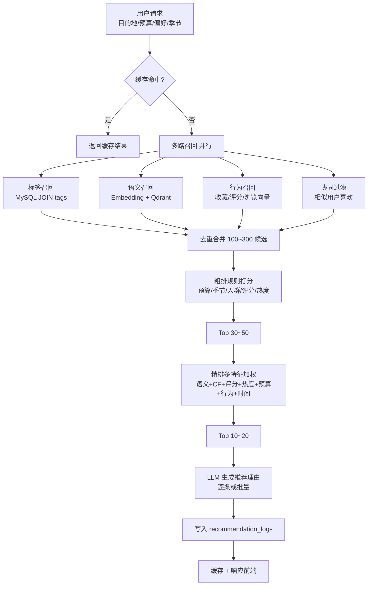

# 移动端旅游 AI 推荐系统 — 完整设计方案

> 本文档为 **独立新产品设计**，与当前仓库「懒得动」周末玩法 App 并行存在。<br>
> 可运行参考代码位于 `reference-server/` 与 `reference-client/`。

---

## 一、系统整体架构

### 1.1 逻辑分层

```text
┌─────────────────────────────────────────────────────────────┐
│  React Native App (iOS / Android)                           │
│  Zustand · Axios · React Navigation · 地图 SDK 预留          │
└───────────────────────────┬─────────────────────────────────┘
                            │ REST / SSE
┌───────────────────────────▼─────────────────────────────────┐
│  Node.js API (Express + TypeScript)                         │
│  JWT · Zod 校验 · 统一响应 · 权限中间件                       │
├─────────────────────────────────────────────────────────────┤
│  业务模块：用户 / 目的地 / 景点 / 收藏 / 评价 / 行程 / 搜索    │
├─────────────────────────────────────────────────────────────┤
│  AI 服务层                                                   │
│  embedding · vectorStore · llm · recall · ranking · trip    │
└───────┬─────────────────────────────┬───────────────────────┘
        │                             │
┌───────▼────────┐           ┌────────▼────────┐
│  MySQL 8       │           │  Qdrant         │
│  结构化数据     │           │  向量检索        │
└────────────────┘           └─────────────────┘
        │
┌───────▼────────┐
│  Redis (可选)   │  推荐结果缓存 10~30 分钟
└────────────────┘
```

### 1.2 AI 推荐数据流（召回 → 粗排 → 精排 → LLM 解释）



### 1.3 技术选型说明（含事实校正）

| 组件 | 选型 | 说明 |
|------|------|------|
| 前端 | React Native + TypeScript | 与现有 lazy2move 的 Expo 栈可复用工程经验 |
| 后端 | Express + TypeScript | 现有 `apps/api` 已是 Express；NestJS 适合更大团队，非必须 |
| 关系库 | MySQL 8 | 全文索引 + JSON 字段足够支撑初版 |
| 向量库 | **Qdrant** | 轻量 Docker 部署；`@qdrant/js-client-rest` 已支持 **Query API**（旧版 `search` 仍可用但官方推荐 `query`） |
| Embedding | text-embedding-3-small | 默认 **1536 维**，可通过 `dimensions` 参数降至 256~1536（MRL 训练） |
| LLM | GPT-4o / GLM-4 / DeepSeek | 通过统一 `llmService` 切换 provider |
| 缓存 | 内存 TtlCache → Redis | 初版可用内存；生产建议 Redis |

---

## 二、MySQL 数据库设计

完整建表 SQL 见 [`schema.sql`](./schema.sql)，共 16 张表：

- 用户：`users`、`user_profiles`、`user_embeddings`
- 内容：`destinations`、`attractions`、`tags` 及关联表
- 行为：`favorites`、`reviews`、`browse_history`
- 行程：`trips`、`trip_items`
- AI 日志：`recommendation_logs`、`ai_generation_logs`
- 管理：`admins`

**设计要点：**

- 向量不存 MySQL BLOB，仅存 `embedding_point_id` 指向 Qdrant
- `browse_history.dwell_seconds` 支持停留时长行为建模
- `recommendation_logs.rec_strategies` 记录多路召回来源，便于离线评估

---

## 三、向量数据库集成方案

### 3.1 Collection 规划

| Collection | 向量来源 | Payload 字段 |
|------------|----------|--------------|
| `attractions` | 名称 + 简介 + 标签 | `attraction_id`, `destination_id`, `name`, `tags` |
| `destinations` | 名称 + 简介 + 标签 | `destination_id`, `name` |
| `users` | 用户偏好文本 | `user_id`, `entity_type=user_preference` |

**向量维度必须与 Embedding 模型一致**（OpenAI text-embedding-3-small 默认 1536）。

### 3.2 Embedding 写入流程（景点入库）

```text
管理员/定时任务 POST /api/attractions/:id/embedding
  → 读取 MySQL 景点 + 标签
  → embeddingService.buildAttractionText()
  → embeddingService.embedOne()
  → vectorStoreService.upsert(attractions, point)
  → UPDATE attractions SET embedding_point_id = ?
```

### 3.3 语义检索流程

```text
用户输入自然语言
  → embedOne(query)
  → vectorStoreService.search(collection, vector, topK, filter?)
  → 用 payload.attraction_id 回查 MySQL 补全详情
  → 返回 score + 业务字段
```

参考实现：`reference-server/src/ai/vectorStore.service.ts`

---

## 四、AI 推荐系统实现

核心代码位于 `reference-server/src/modules/recommendations/`：

| 文件 | 职责 |
|------|------|
| `recall.service.ts` | 四路召回并行 + 去重 |
| `ranking.service.ts` | 粗排 / 精排公式 |
| `recommendation.service.ts` | 主流程串联 + 缓存 + 日志 + LLM 理由 |

### 粗排公式

```js
roughScore =
  budgetMatch * 0.3 +
  seasonMatch * 0.2 +
  audienceMatch * 0.2 +
  ratingScore * 0.15 +
  popularityScore * 0.15
```

### 精排公式

```js
finalScore =
  semanticSimilarity * 0.30 +
  collaborativeScore * 0.20 +
  ratingScore * 0.15 +
  popularityScore * 0.10 +
  budgetScore * 0.10 +
  historyBoost * 0.10 +
  timeMatchScore * 0.05
```

---

## 五、AI 行程生成

- Prompt 模板：`reference-server/src/ai/prompts/index.ts`
- 服务：`reference-server/src/modules/trips/tripGeneration.service.ts`
- **SSE 流式**（推荐）：`POST /api/trips/ai-generate` + `{ stream: true }`
- **异步轮询**：`{ stream: false }` → 返回 `taskId` → `GET /api/trips/ai-generate/:taskId`
- 解析 JSON 后写入 `trips` + `trip_items`

---

## 六、语义搜索

- 服务：`reference-server/src/modules/search/semanticSearch.service.ts`
- 接口：`POST /api/search/semantic`
- 与关键词搜索互补：MySQL `FULLTEXT` 做精确词匹配，Qdrant 做意图理解

---

## 七、RESTful API 设计

### 7.1 统一响应格式

成功：

```json
{ "code": 0, "message": "success", "data": {} }
```

失败：

```json
{ "code": 40001, "message": "参数错误", "data": null }
```

### 7.2 AI 专用接口

| 方法 | 路径 | 说明 |
|------|------|------|
| POST | `/api/recommendations/ai` | 多路召回 + 精排 + LLM 理由 |
| POST | `/api/search/semantic` | 语义搜索 |
| POST | `/api/trips/ai-generate` | AI 行程（SSE 或异步） |
| GET | `/api/trips/ai-generate/:taskId` | 查询异步任务 |
| POST | `/api/attractions/:id/embedding` | 管理员触发 Embedding |
| POST | `/api/users/me/embedding` | 更新用户偏好向量 |

### 7.3 推荐接口示例

**请求：**

```json
{
  "destination": "云南",
  "days": 5,
  "budget": 5000,
  "travelers": 2,
  "tripType": "情侣游",
  "preferences": ["自然风光", "历史文化"],
  "season": "夏季"
}
```

**响应：**

```json
{
  "code": 0,
  "message": "success",
  "data": {
    "recommendations": [
      {
        "attractionId": 101,
        "name": "玉龙雪山",
        "score": 0.92,
        "matchTags": ["自然风光", "情侣游"],
        "aiReason": "玉龙雪山雪峰与蓝天交相辉映，非常适合情侣拍照，也符合你偏爱自然风光的兴趣。",
        "recStrategy": ["semantic", "collaborative"],
        "rating": 4.8,
        "priceRange": "150-200"
      }
    ],
    "total": 15,
    "page": 1
  }
}
```

### 7.4 常规业务接口（摘要）

| 模块 | 代表接口 |
|------|----------|
| 认证 | `POST /api/auth/register` `POST /api/auth/login` |
| 用户 | `GET/PATCH /api/users/me` `PUT /api/users/me/preferences` |
| 目的地 | `GET /api/destinations` `GET /api/destinations/:id` |
| 景点 | `GET /api/attractions` `GET /api/attractions/:id` |
| 收藏 | `POST/DELETE /api/favorites` `GET /api/favorites` |
| 评价 | `POST /api/reviews` `GET /api/attractions/:id/reviews` |
| 浏览 | `POST /api/browse-history` |
| 行程 | `CRUD /api/trips` `PATCH /api/trips/:id/items/reorder` |

---

## 八、前端页面结构

| 页面 | 文件示例 |
|------|----------|
| AI 推荐结果 | `reference-client/.../AIRecommendScreen.tsx` |
| AI 行程生成 | `reference-client/.../AITripGenerateScreen.tsx` |
| 语义搜索 | `reference-client/.../SemanticSearchScreen.tsx` |
| 流式文字 | `reference-client/.../StreamingText.tsx` |

**状态管理建议（Zustand）：**

- `userStore`：登录态、偏好标签
- `recommendStore`：最近推荐参数与结果缓存
- `tripStore`：当前编辑中的行程

**地图预留：** 抽象 `MapProvider` 接口，国内接 `@uiw/react-amap` / 原生高德 SDK，海外接 `react-native-maps` + Google。

---

## 九、项目初始化与本地运行

### 9.1 环境要求

- macOS（你当前开发环境）+ Node.js 20+
- MySQL 8.0+
- Docker（运行 Qdrant）
- OpenAI / 智谱 / DeepSeek API Key（至少一种）

### 9.2 初始化步骤

```bash
# 1. 创建数据库
mysql -u root -p < docs/travel-ai-recommendation/schema.sql

# 2. 启动 Qdrant
docker run -p 6333:6333 -p 6334:6334 qdrant/qdrant

# 3. 启动参考后端
cd docs/travel-ai-recommendation/reference-server
cp .env.example .env
# 编辑 .env 填入 DB 和 API Key
npm install
npm run dev
# → http://localhost:3002

# 4. 前端（接入现有 Expo 或独立 RN 项目）
# 将 reference-client/src 下的模块复制到 apps/client/src
# 设置 EXPO_PUBLIC_API_URL=http://localhost:3002/api
```

### 9.3 验证 AI 推荐

```bash
curl -X POST http://localhost:3002/api/recommendations/ai \
  -H "Content-Type: application/json" \
  -d '{"destination":"云南","preferences":["自然风光"],"budget":5000,"tripType":"情侣游"}'
```

---

## 十、冷启动方案（新用户无历史行为）

| 场景 | 策略 |
|------|------|
| 无浏览/收藏/评分 | **跳过**行为召回与协同过滤，权重自动转移到标签 + 语义召回 |
| 无偏好标签 | Onboarding 引导选择 3~5 个标签；或使用目的地热门榜兜底 |
| 无用户 Embedding | 用「偏好标签 + 出行类型 + 预算」拼接文本临时生成 Embedding |
| 全局热门兜底 | 按 `popularity DESC, rating DESC` 取 Top-N 保证非空结果 |
| 新景点 | 入库时同步生成 Embedding；未生成前仅参与标签/规则召回 |
| 探索 vs 利用 | 10% 随机插入高评分但未召回景点，避免信息茧房 |

**代码层实现：** `recall.service.ts` 中 `behaviorRecall` / `collaborativeRecall` 在无 `userId` 或空历史时返回 `[]`，不会阻断主流程。

---

## 十一、后续扩展建议

1. **地图导航**：行程项绑定经纬度，调用高德/Google 路线规划 API 优化日内顺序（TSP 近似）
2. **天气联动**：接入和风天气，雨天降权户外景点
3. **多语言**：i18n + 多语言 Embedding（或统一英文 Embedding + 翻译层）
4. **A/B 测试**：`recommendation_logs` 记录实验分组，对比 CTR / 收藏率
5. **反馈闭环**：「不感兴趣」按钮写入负样本，精排降权
6. **离线协同过滤**：用户量大后拆 Python 微服务，Node 只读 Redis 中的 CF 分数
7. **RAG 增强**：LLM 理由生成时注入景点最新评论摘要
8. **成本优化**：推荐理由批量生成；Embedding 结果持久缓存；Qdrant 向量量化

---

## 十二、文件索引

```text
docs/travel-ai-recommendation/
├── README.md                 # 本文档
├── schema.sql                # 完整建表 SQL
├── reference-server/         # 可运行后端参考实现
│   └── src/
│       ├── ai/               # embedding / vectorStore / llm
│       └── modules/          # recommendations / trips / search
└── reference-client/         # RN 关键页面与组件示例
    └── src/
        ├── api/
        ├── components/
        └── screens/
```

---

## 与现有 lazy2move 的关系

当前仓库是「周末本地玩法决策」产品，数据库是 `cities` + `activities`。<br>
本设计是 **旅游推荐新产品**，建议：

- **方案 A（推荐）**：新建 `apps/travel-api` + 独立库 `travel_ai`，避免污染现有 schema
- **方案 B**：在 lazy2move 上演进，需大规模迁移表结构与产品定位

如需我 **直接在仓库里落地集成**（迁移 schema、接线 Expo 页面），请明确选择方案 A 或 B 后再动手。
